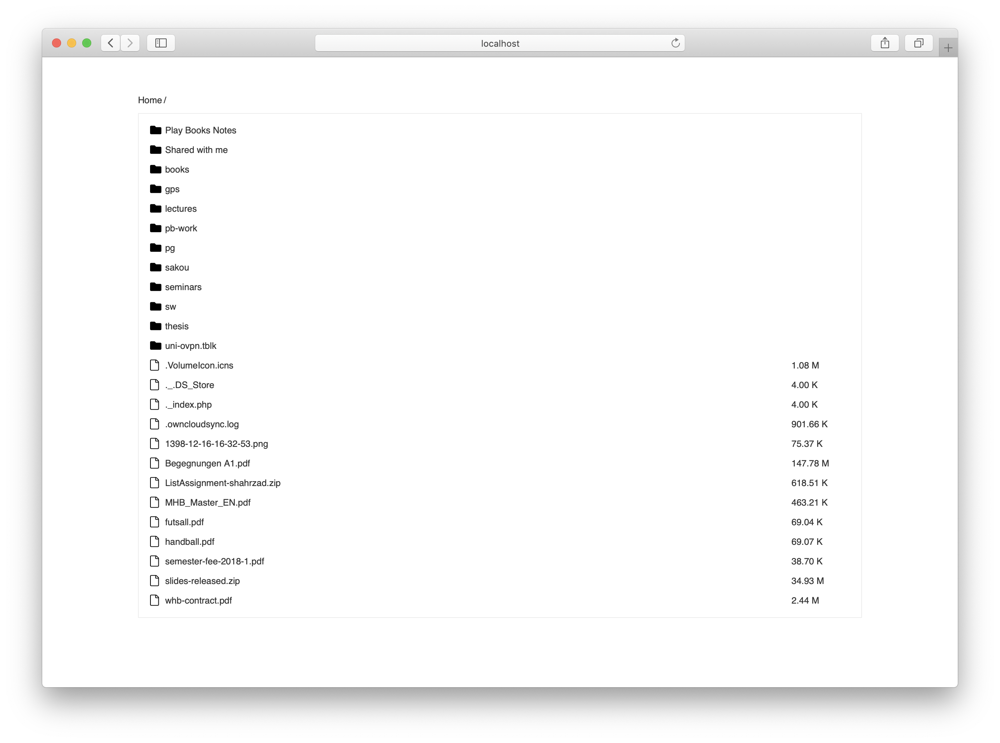

# Listor
A simple directory lister script

## Usage
Download the repository, unzip it and move the `index.php` in the web server's root folder.

```
$ wget https://github.com/saman/listor/archive/master.zip
$ unzip listor-master.zip
$ mv listor-master/index.php /var/www/html
```
## Demo


